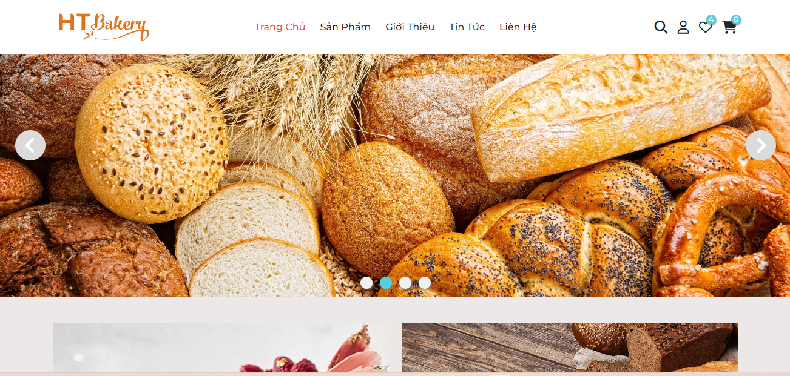
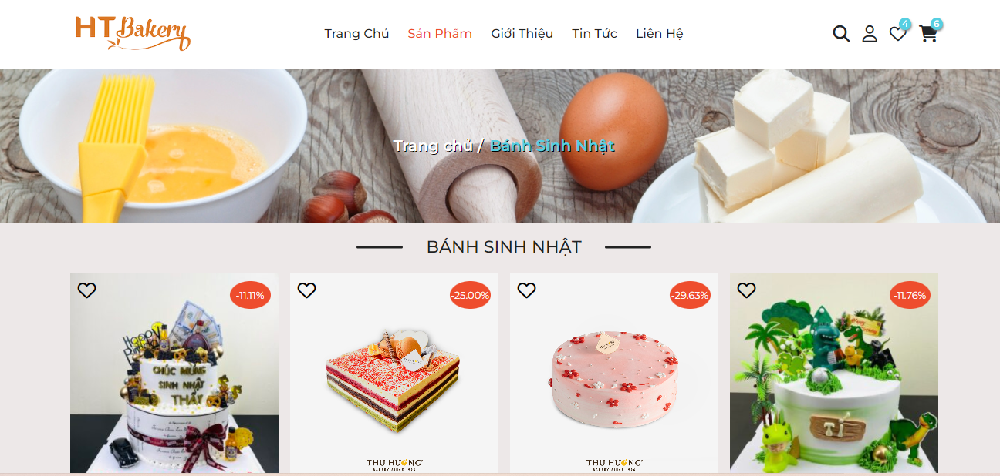
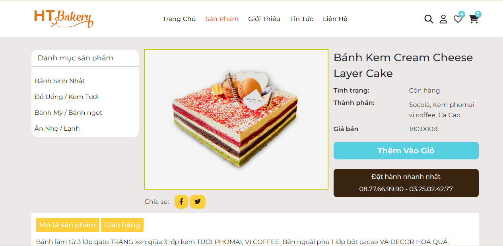
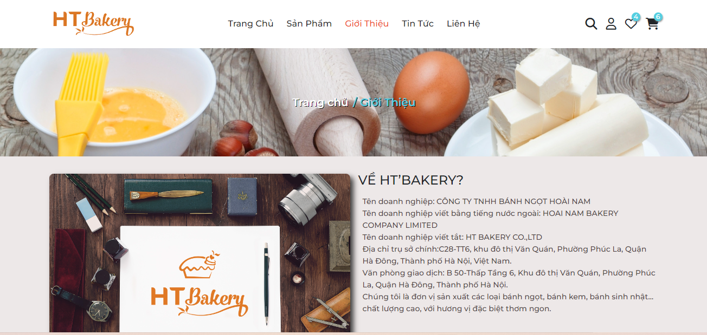
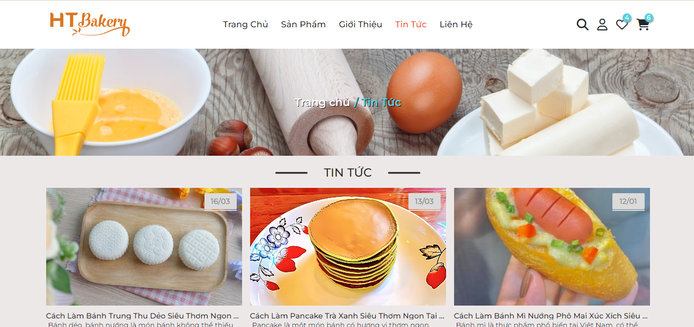
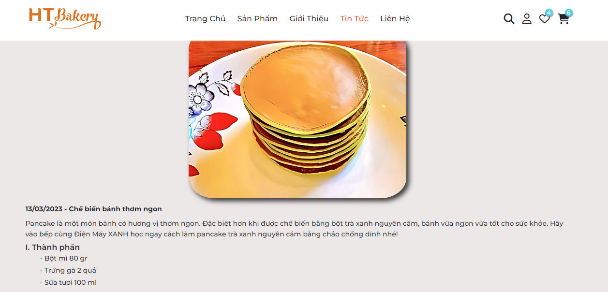

# Bakery
<h1>Website bán bánh sinh nhật</h1>
<h2>Giới thiệu</h2>

Dự án này mình chỉ làm Giao diện Fetch API từ Json. (HTML , CSS (SCSS, BootStrap 5), JavaScript (ES6), Jquery, )

<h2>Page</h2>

<ul>
    <li>
        
Home

        <figure>
            
            <figcaption>Giao diện trang trang chủ</figcaption>
        </figure>
    </li>
    <li>
     
Sản phẩm

        <figure>
            
            <figcaption>Giao diện trang sản phẩm</figcaption>
        </figure>
    </li>
  <li>
     
Sản phẩm chi tiết

        <figure>
            
            <figcaption>Giao diện trang sản phẩm chi tiết</figcaption>
        </figure>
    </li>
    <li>
     
Giới thiệu

        <figure>
            
            <figcaption>Giao diện trang Giới thiệu</figcaption>
        </figure>
    </li>
    <li>
       
Tin tức

        <figure>
            
            <figcaption>Giao diện trang Tin tức</figcaption>
        </figure>
    </li>
     <li>
     
Tin tức chi tiết

        <figure>
            
            <figcaption>Giao diện trang Tin tức chi tiết</figcaption>
        </figure>
    </li>
</ul>

<h2>Một số chức năng cơ bản </h2>

<ul>
    <li>Responsive</li>
    <li>Search</li>
    <li>Slider</li>
    <li>Cart</li>
    <li>Effect</li>
</ul>
